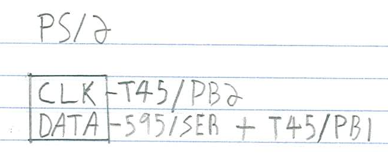
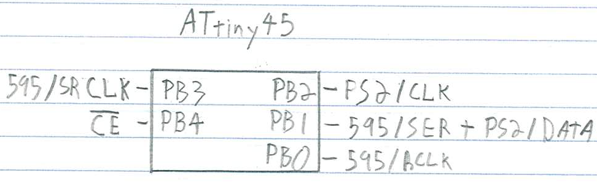
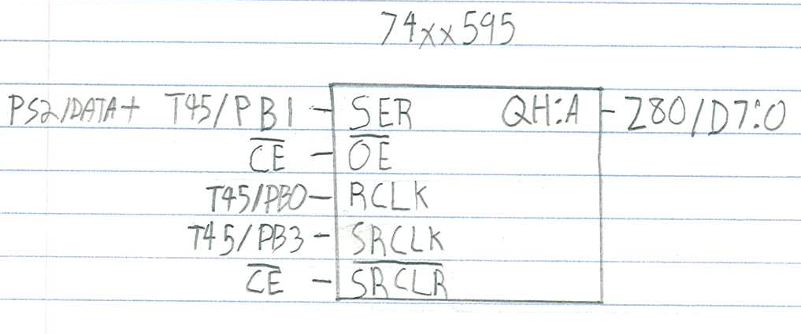
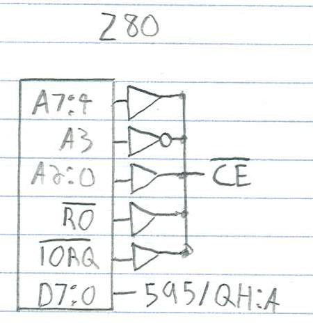

# Interfacing a PS/2 keyboard

Serial connection through ACIA is nice, but you are probably plugging a modern
computer on the other side of that ACIA, right? Let's go a step further away
from those machines and drive a PS/2 keyboard directly!

## Goal

Have a PS/2 keyboard drive the stdio input of the Collapse OS shell instead of
the ACIA.

**Status: work in progress**

## Gathering parts

* A RC2014 Classic that could install the base recipe
* A PS/2 keyboard. A USB keyboard + PS/2 adapter should work, but I haven't
  tried it yet.
* A PS/2 female connector. Not so readily available, at least not on digikey. I
  de-soldered mine from an old motherboard I had laying around.
* ATtiny85/45/25 (main MCU for the device)
* 74xx595 (shift register)
* 40106 inverter gates
* Diodes for `A*`, `IORQ`, `RO`.
* Proto board, RC2014 header pins, wires, IC sockets, etc.
* [AVRA][avra]

## Building the PS/2 interface

Let's start with the PS/2 connector, which has two pins:

Both are connected to the ATtiny45, `CLK` being on `PB2` to have `INT0` on it.

The `DATA` line is multi-use. That is, `PB1` is connected both to the PS/2 data
line and to the 595's `SER`. This saves us a precious pin.

The ATtiny 45 hooks everything together. `CE` comes from the z80 bus, see below.

This allows us to supply the z80 bus with data within its 375ns limits. `SRCLR`
is hooked to the `CE` line so that whenever a byte is read, the 595 is zeroed
out as fast as possible so that the z80 doesn't read "false doubles".

The 595, to have its `SRCLR` becoming effective, needs a `RCLK` trigger, which
doesn't happen immediately. It's the ATtiny45, in its `PCINT` interrupt, that
takes care of doing that trigger (as fast as possible).

Our device is read only, on one port. That makes the "Chip Enable" (`CE`)
selection rather simple. In my design, I chose the IO port 8, so I inverted
`A3`. I chose a 40106 inverter to do that, do as you please for your own design.

I wanted to hook `CE` to a flip flop so that the MCU could relax a bit more
w.r.t. reacting to its `PB4` pin changes, but I didn't have NAND gates that are
fast enough in stock, so I went with this design. But otherwise, I would
probably have gone the flip-flop way. Seems more solid.

## Using the PS/2 interface

After having built and flashed the `glue.asm` supplied with this recipe, you end
up with a shell driven by the PS/2 keyboard (but it still outputs to ACIA).

There are still a few glitches, especially at initialization or at connect and
disconnect, but it otherwise works rather well!

[avra]: https://github.com/hsoft/avra
